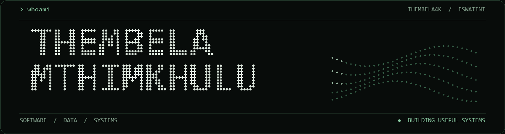

  

<h2 align="center">I turn data, processes and ideas into working systems.</h2>

  Management Information Systems Officer at <a href="https://datamatics.co.sz/"><strong>Datamatics Eswatini</strong></a> · Based in Mbabane, Eswatini

  <a href="https://darkgray-lark-804349.hostingersite.com/">Portfolio & case studies</a>
  &nbsp;·&nbsp;
  <a href="https://www.linkedin.com/in/thembela-mthimkhulu-15a0a1289/">LinkedIn</a>
  &nbsp;·&nbsp;
  <a href="mailto:thembelamthimkhulu0@gmail.com">Email</a>

---

### What I build

| Systems | Data | Applied AI |
| :--- | :--- | :--- |
| Database-backed applications and practical workflows for teams. | Dashboards, validation checks and reporting that make information useful. | Grounded assistants, forecasting and controlled document generation. |

### Selected work

| Project | What I delivered |
| :--- | :--- |
| [Operations Core CRM](https://github.com/Thembela4K/operations-core-crm) | A public Laravel and MySQL operations portal for clients, finance, approvals, assignments and reporting. |
| [ESPPRA AI Assistant & Dashboard](https://darkgray-lark-804349.hostingersite.com/#projects) | An AI and analytics layer connected to operational data, with forecasting, monitoring and reviewed Word/PDF reports. The case study has screenshots; the system itself is private. |
| [Portfolio & project gallery](https://darkgray-lark-804349.hostingersite.com/) | A React and TypeScript site showing completed MIS, BI, GIS and software projects. |

### Toolkit

`Laravel` · `PHP` · `React` · `TypeScript` · `Node.js` · `SQL` · `MySQL` · `PostgreSQL` · `Power BI` · `Python` · `C# / WPF`

  Built in Eswatini · Focused on software that people can use and trust

