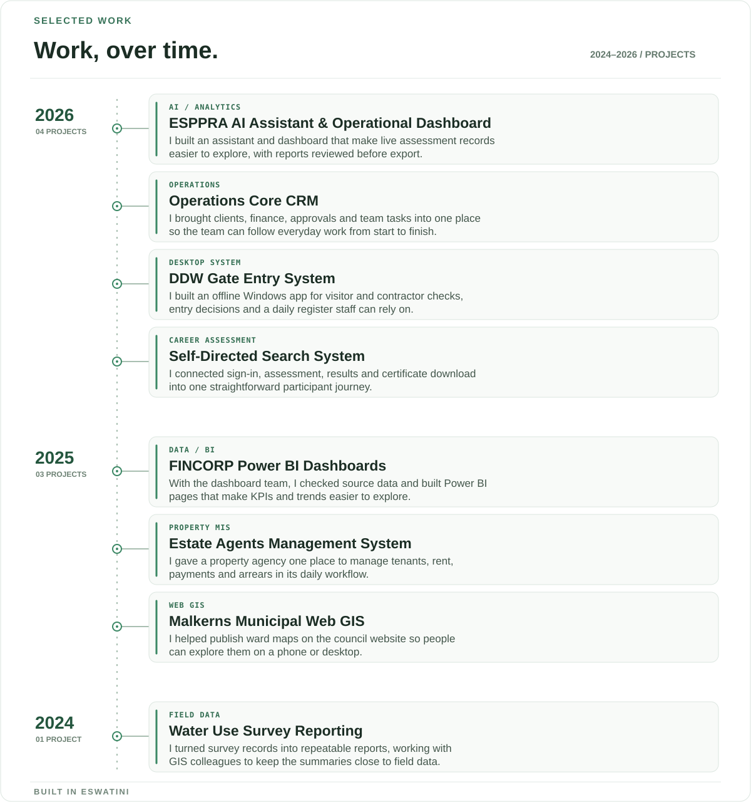

  

<h2 align="center">I turn data, processes and ideas into working systems.</h2>

  Management Information Systems Officer at <a href="https://datamatics.co.sz/"><strong>Datamatics Eswatini</strong></a> · Based in Mbabane, Eswatini

  <a href="https://darkgray-lark-804349.hostingersite.com/">Portfolio & case studies</a>
  &nbsp;·&nbsp;
  <a href="https://www.linkedin.com/in/thembela-mthimkhulu-15a0a1289/">LinkedIn</a>
  &nbsp;·&nbsp;
  <a href="mailto:thembelamthimkhulu0@gmail.com">Email</a>

---

### What I build

| Systems | Data | Applied AI |
| :--- | :--- | :--- |
| Database-backed applications and practical workflows for teams. | Dashboards, validation checks and reporting that make information useful. | Grounded assistants, forecasting and controlled document generation. |

### Selected work

  

Read the project stories as text

- **ESPPRA AI Assistant & Operational Dashboard** — I built the assistant and dashboard layer for a workload assessment platform. Staff can explore current records, follow trends and prepare reports that go through review before export.

- **Operations Core CRM** — I brought client records, quotations, invoices, approvals and team assignments into one Laravel system for Datamatics. It gives the team a clearer way to follow everyday work from start to finish.

- **DDW Gate Entry System** — I built this offline Windows application on my own. It helps site staff screen visitors and contractors, record decisions and keep a daily entry register.

- **Self-Directed Search System** — I connected the screens, API and database so participants can register, complete a career assessment, see their results and download a certificate in one flow.

- **FINCORP Power BI Dashboards** — As part of the dashboard team, I prepared and checked source data with SQL and Power Query, then built reporting pages that make KPIs and trends easier to explore.

- **Estate Agents Management System** — I built a property management system for VJR Estate Agents, bringing tenant, rental, payment and arrears records into one day-to-day workflow.

- **Malkerns Municipal Web GIS** — I worked with the web support team to put ward maps on the council website and make them usable on both phones and desktop screens.

- **Water Use Survey Reporting** — After the field survey, I turned Microsoft Access records into repeatable reports and worked with GIS colleagues to keep the summaries aligned with the captured data.

### Toolkit

`Laravel` · `PHP` · `React` · `TypeScript` · `Node.js` · `SQL` · `MySQL` · `PostgreSQL` · `Power BI` · `Python` · `C# / WPF`

  Built in Eswatini · Focused on software that people can use and trust

